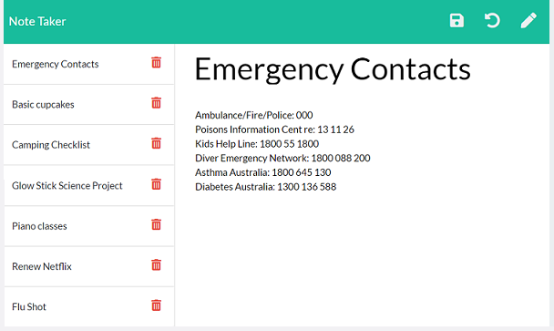
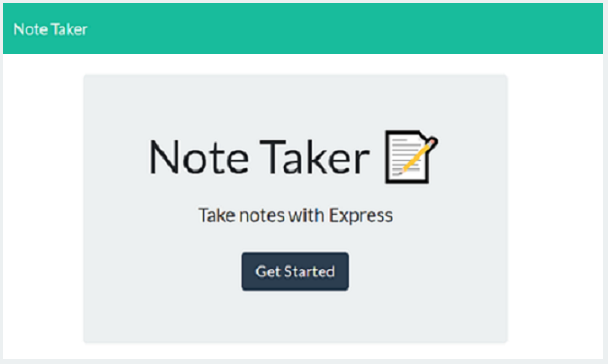
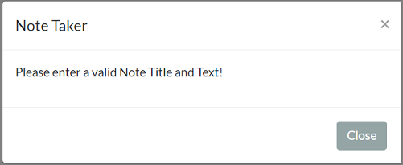
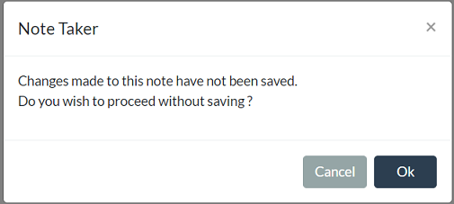

# Express Note Taker

## Description 
<br>

<br><br>

The Note Taker application lets users organize their thoughts and keep track of tasks that need to be done, by proving them with a quick and easy way to create, save, and delete notes on the go. It is powered by Node.js and uses an express backend server. The application also uses a JSON file as a data store to persist notes and work with note data. <br>

Deployed Application: [Note Tracker](https://polar-dawn-12559.herokuapp.com/)
<br><br>

## Table of Contents 

- [Installation Instructions](#installation-instructions)
- [Usage Guidelines](#usage-guidelines)
<br><br>

## Installation Instructions

- #### Node.js  
This application needs Node.js to execute. To install Node.js, run the appropriate installer from https://nodejs.org/en/download/ and follow the prompts to complete the installation. 

- #### Clone this repo
 Clone this repo to your local machine using:
```shell
git clone `https://github.com/Gveetil/Express-Note-Taker.git`
```

- #### Install packages
You will also need to install the express npm package to your environment. 

 Browse to the folder where you cloned the Repo and install the package:
```shell
$ npm install 
```

- #### Start the server
To run the server, browse to the local folder where you cloned the Repo and execute 
```shell
$ npm start 
```
The server should now start executing.

- #### Open the Website
Browse to http://localhost:3000 to view the application website.<br><br>

## Usage Guidelines

When the Note Taker application is opened, it displays a welcome page:<br><br>

<br><br>

On Clicking `Get Started`, the application loads up all the notes saved in the system, as below: <br><br>

<br><br>

* To add a new note - enter the title and text of the note and click the save icon on the toolbar.
* To edit an existing note - click on a note from the list to load it. Then update the text and/or the title and click the save icon on the toolbar.
* To delete a note - click on the delete icon next to it.
* To revert / undo changes made to a note when editing, click on the undo icon in the toolbar.
* The save icon and undo icon are only available if there are changes made to the note.
* If the user selects save and the note text or title is not entered, the below validation is displayed:<br><br>
  
<br><br>

* If the user has made changes to a note and clicks on the new / edit / delete  options without saving the note, the below message is displayed:<br><br>

<br><br>

* Selecting cancel / close allows the user to continue editing and saving the data.
* If the user chooses the ok option, the note is not saved and the application proceeds with the action requested.

